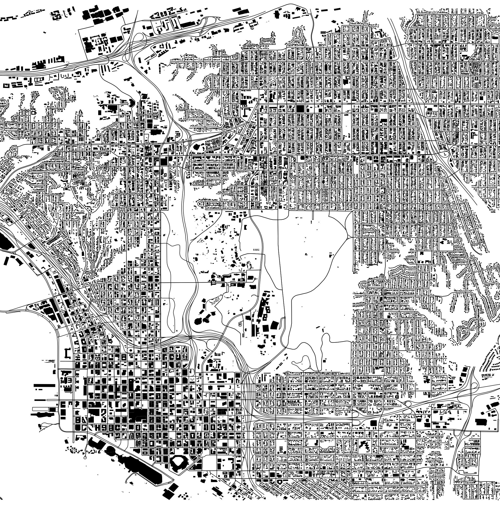

# Project Description

Visualization of the urban data on roads and buildings of up- and downtown San Diego.

## Data

Pulled from OpenStreetMap on AWS. Two options: data_hillcrest.csv (for San Diego) and data_UCSD.csv (for UC San Diego).

## Implementation

Python Notebook. Used packages: pandas, pyproj, functools, pyplot, geopandas, osmnx, shapely.

